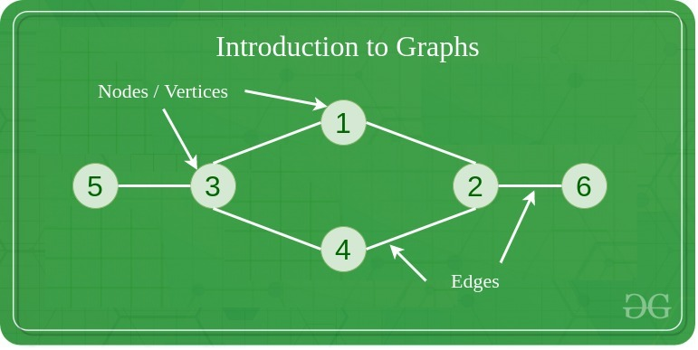
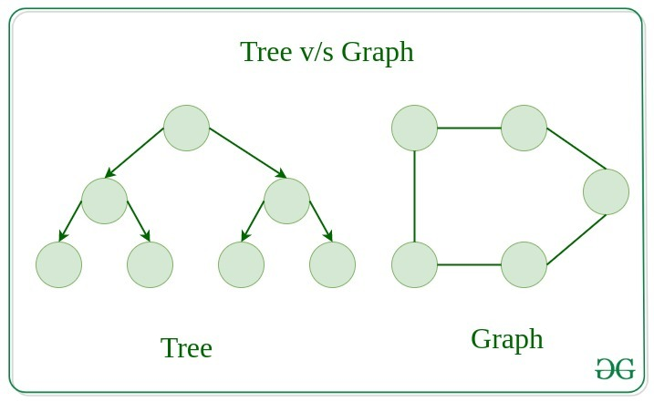
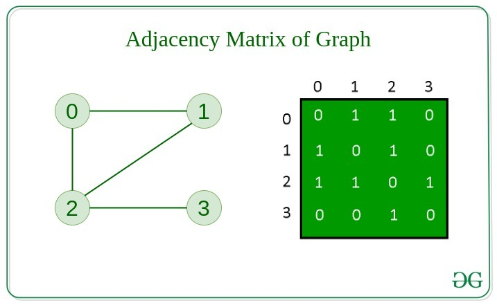
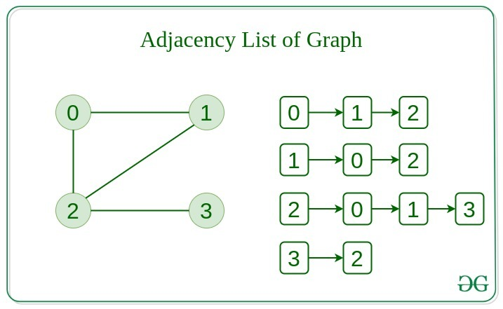
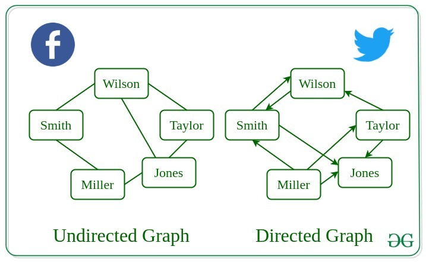
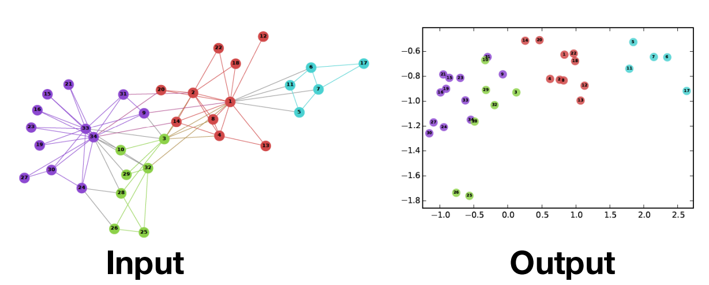

# 1. Graph and vulnerability detection systems based on Graphs

- [1. Graph and vulnerability detection systems based on Graphs](#1-graph-and-vulnerability-detection-systems-based-on-graphs)
	- [1.1. Day 1](#11-day-1)
		- [1.1.1. Introduction to Graphs](#111-introduction-to-graphs)
			- [1.1.1.1. Types of Graphs](#1111-types-of-graphs)
			- [1.1.1.2. Tree vs Graphs](#1112-tree-vs-graphs)
			- [1.1.1.3. Representation of Graphs](#1113-representation-of-graphs)
			- [1.1.1.4. Basic Operations on Graphs](#1114-basic-operations-on-graphs)
			- [1.1.1.5. Usage of Graphs](#1115-usage-of-graphs)
			- [1.1.1.6. Real-life Application of Graphs](#1116-real-life-application-of-graphs)
		- [1.1.2. Graph and its representations](#112-graph-and-its-representations)
			- [Implementation of Adjacency Matrix](#implementation-of-adjacency-matrix)
			- [Implementation of Adjacency List](#implementation-of-adjacency-list)
		- [BFS \& DFS in Graphs](#bfs--dfs-in-graphs)
			- [Breadth First Traversal for a Graph](#breadth-first-traversal-for-a-graph)
			- [Depth First Traversal for a Graph](#depth-first-traversal-for-a-graph)
	- [Day 2](#day-2)
	- [1.2. Application](#12-application)
	- [1.3. Library](#13-library)
		- [1.3.1. Breadth First Traversal for a Graph](#131-breadth-first-traversal-for-a-graph)
		- [1.3.2. Depth First Traversal for a Graph](#132-depth-first-traversal-for-a-graph)
	- [1.4. Tutorial Representation Learning on Networks](#14-tutorial-representation-learning-on-networks)
	- [1.5. Tutorial GNN](#15-tutorial-gnn)
		- [1.5.1. Node embeddings](#151-node-embeddings)
		- [1.5.2. Graph neural networks](#152-graph-neural-networks)
	- [1.6. Graph Neural Network - A literature review and applications](#16-graph-neural-network---a-literature-review-and-applications)
	- [1.7. Graph Neural Network and Some of GNN Applications: Everything You Need to Know](#17-graph-neural-network-and-some-of-gnn-applications-everything-you-need-to-know)
	- [1.8. Creating Message Passing Networks](#18-creating-message-passing-networks)
	- [1.9. Computational Graph in PyTorch](#19-computational-graph-in-pytorch)
	- [1.10. GCN](#110-gcn)
	- [1.11. pytorch\_geometric.nn](#111-pytorch_geometricnn)


## 1.1. Day 1


### 1.1.1. Introduction to Graphs 
- https://www.geeksforgeeks.org/introduction-to-graphs-data-structure-and-algorithm-tutorials/



#### 1.1.1.1. Types of Graphs
- Null Graph
- Trivial Graph
- Undirected Graph 
- Directed Graph
- Connected Graph 
- Disconnected Graph
- Regular Graph 
- Complete Graph
- Cycle Graph
- Cyclic Graph 
- Directed Acyclic Graph
- Bipartite Graph
- Weighted Graph


#### 1.1.1.2. Tree vs Graphs


#### 1.1.1.3. Representation of Graphs

- Adjacency Matrix




- Adjacency List



#### 1.1.1.4. Basic Operations on Graphs 

- Insertion of Nodes/Edges in the graph – Insert a node into the graph.
- Deletion of Nodes/Edges in the graph – Delete a node from the graph.
- Searching on Graphs – Search an entity in the graph.
- Traversal of Graphs – Traversing all the nodes in the graph.

#### 1.1.1.5. Usage of Graphs

#### 1.1.1.6. Real-life Application of Graphs




### 1.1.2. Graph and its representations 
- https://www.geeksforgeeks.org/graph-and-its-representations/


#### Implementation of Adjacency Matrix

```python

if __name__ == '__main__':
     
    #  n is the number of vertices
    #  m is the number of edges
    n, m = map(int, input().split())
    adjMat = [[0 for i in range(n)]for j in range(n)]
    for i in range(n):
        u, v = map(int, input().split())
        adjMat[u][v] = 1
        adjMat[v][u] = 1
        # for a directed graph with an edge
        # pointing from u to v,we just assign
        # adjMat[u][v] as 1
```

#### Implementation of Adjacency List
```python
"""
A Python program to demonstrate the adjacency
list representation of the graph
"""


# A class to represent the adjacency list of the node
class AdjNode:
	def __init__(self, data):
		self.vertex = data
		self.next = None


# A class to represent a graph. A graph
# is the list of the adjacency lists.
# Size of the array will be the no. of the
# vertices "V"
class Graph:
	def __init__(self, vertices):
		self.V = vertices
		self.graph = [None] * self.V

	# Function to add an edge in an undirected graph
	def add_edge(self, src, dest):
		# Adding the node to the source node
		node = AdjNode(dest)
		node.next = self.graph[src]
		self.graph[src] = node

		# Adding the source node to the destination as
		# it is the undirected graph
		node = AdjNode(src)
		node.next = self.graph[dest]
		self.graph[dest] = node

	# Function to print the graph
	def print_graph(self):
		for i in range(self.V):
			print("Adjacency list of vertex {}\n head".format(i), end="")
			temp = self.graph[i]
			while temp:
				print(" -> {}".format(temp.vertex), end="")
				temp = temp.next
			print(" \n")


# Driver program to the above graph class
if __name__ == "__main__":
	V = 5
	graph = Graph(V)
	graph.add_edge(0, 1)
	graph.add_edge(0, 4)
	graph.add_edge(1, 2)
	graph.add_edge(1, 3)
	graph.add_edge(1, 4)
	graph.add_edge(2, 3)
	graph.add_edge(3, 4)

	graph.print_graph()

# This code is contributed by Kanav Malhotra

```
### BFS & DFS in Graphs
- https://www.geeksforgeeks.org/breadth-first-search-or-bfs-for-a-graph/
- https://www.geeksforgeeks.org/depth-first-search-or-dfs-for-a-graph/
#### Breadth First Traversal for a Graph
- Algorithm of Breadth-First Search
  - Step 1: Consider the graph you want to navigate.
  - Step 2: Select any vertex in your graph (say v1), from which you want to traverse the graph.
  - Step 3: Utilize the following two data structures for traversing the graph.
    - Visited array(size of the graph)
    - Queue data structure
  - Step 4: Add the starting vertex to the visited array, and afterward, you add v1’s adjacent vertices to the queue data structure.
  - Step 5: Now using the FIFO concept, remove the first element from the queue, put it into the visited array, and then add the adjacent vertices of the removed element to the queue.
  - Step 6: Repeat step 5 until the queue is not empty and no vertex is left to be visited.

- Implementation of BFS traversal on Graph
```python
# Python3 Program to print BFS traversal
# from a given source vertex. BFS(int s)
# traverses vertices reachable from s.

from collections import defaultdict


# This class represents a directed graph
# using adjacency list representation
class Graph:

	# Constructor
	def __init__(self):

		# Default dictionary to store graph
		self.graph = defaultdict(list)

	# Function to add an edge to graph
	def addEdge(self, u, v):
		self.graph[u].append(v)

	# Function to print a BFS of graph
	def BFS(self, s):

		# Mark all the vertices as not visited
		visited = [False] * (max(self.graph) + 1)

		# Create a queue for BFS
		queue = []

		# Mark the source node as
		# visited and enqueue it
		queue.append(s)
		visited[s] = True

		while queue:

			# Dequeue a vertex from
			# queue and print it
			s = queue.pop(0)
			print(s, end=" ")

			# Get all adjacent vertices of the
			# dequeued vertex s. If a adjacent
			# has not been visited, then mark it
			# visited and enqueue it
			for i in self.graph[s]:
				if visited[i] == False:
					queue.append(i)
					visited[i] = True


# Driver code
if __name__ == '__main__':

	# Create a graph given in
	# the above diagram
	g = Graph()
	g.addEdge(0, 1)
	g.addEdge(0, 2)
	g.addEdge(1, 2)
	g.addEdge(2, 0)
	g.addEdge(2, 3)
	g.addEdge(3, 3)

	print("Following is Breadth First Traversal"
		" (starting from vertex 2)")
	g.BFS(2)

# This code is contributed by Neelam Yadav

```

#### Depth First Traversal for a Graph
- Implement DFS

```python
'''Python3 program to print DFS traversal for complete graph'''
from collections import defaultdict

# this class represents a directed graph using adjacency list representation


class Graph:
	# Constructor
	def __init__(self):
		# default dictionary to store graph
		self.graph = defaultdict(list)

	# Function to add an edge to graph
	def addEdge(self, u, v):
		self.graph[u].append(v)
	# A function used by DFS

	def DFSUtil(self, v, visited):
		# Mark the current node as visited and print it
		visited.add(v)
		print(v, end=" ")

	# recur for all the vertices adjacent to this vertex
		for neighbour in self.graph[v]:
			if neighbour not in visited:
				self.DFSUtil(neighbour, visited)
	# The function to do DFS traversal. It uses recursive DFSUtil

	def DFS(self):
		# create a set to store all visited vertices
		visited = set()
	# call the recursive helper function to print DFS traversal starting from all
	# vertices one by one
		for vertex in self.graph:
			if vertex not in visited:
				self.DFSUtil(vertex, visited)
# Driver's code
# create a graph given in the above diagram


if __name__ == "__main__":
	print("Following is Depth First Traversal \n")
	g = Graph()
	g.addEdge(0, 1)
	g.addEdge(0, 2)
	g.addEdge(1, 2)
	g.addEdge(2, 0)
	g.addEdge(2, 3)
	g.addEdge(3, 3)

	# Function call
	g.DFS()

# This code is contributed by Priyank Namdeo

```
## Day 2

## 1.2. Application
## 1.3. Library 

- Pytorch geometric
- DGL
- Networkx


### 1.3.1. Breadth First Traversal for a Graph

### 1.3.2. Depth First Traversal for a Graph

## 1.4. Tutorial Representation Learning on Networks
- http://snap.stanford.edu/proj/embeddings-www/
- Node embeddings -> Map nodes to low-dimensional embeddings 
  - DeepWalk
  - Node2vec
- Graph neural networks -> Deep Learning architectures for graph-structured data

## 1.5. Tutorial GNN

- https://drive.google.com/file/d/1rvm6Yq6-Ss4UmxLDIPTReJJkAdcXdhFb/view


### 1.5.1. Node embeddings



- Random Walk Approaches 
- node2vec: Biased Walks 
### 1.5.2. Graph neural networks
- The basics 
- Graph convolutional networks 
- GraphSAGE
- Gated Graph Neural Networks 
- Subgraph Embeddings 

## 1.6. Graph Neural Network - A literature review and applications
- https://viblo.asia/p/deep-learning-graph-neural-network-a-literature-review-and-applications-6J3ZgP0qlmB#_node-embedding-6


## 1.7. Graph Neural Network and Some of GNN Applications: Everything You Need to Know

- https://neptune.ai/blog/graph-neural-network-and-some-of-gnn-applications


## 1.8. Creating Message Passing Networks

## 1.9. Computational Graph in PyTorch

- https://www.geeksforgeeks.org/computational-graph-in-pytorch/

## 1.10. GCN 

- https://viblo.asia/p/tan-man-ve-graph-convolution-networks-phan-1-6J3Zga8A5mB
- https://viblo.asia/p/tan-man-ve-graph-convolution-networks-phan-2-gAm5y7NqZdb


## 1.11. pytorch_geometric.nn

- Convolutional Layers 
- Aggregation Operators 
- Normalization Layers 
- Pooling Layers 
- Unpooling Layers 
- Models 
- KGE Models 
- Encodings 
- Functional 
- Dense Convolutional Layers 
- Dense Pooling Layers 
- Model Transformations 
- DataParallel Layers
- Model Hub
- Model Summary
